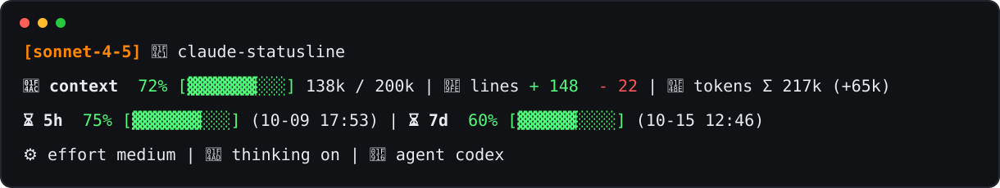

# Claude Statusline

A compact Claude Code statusline for model, workspace, context, rate limits,
token usage, cost, git branch, and agent metadata.

## Preview



## Features

- Multi-line Claude Code statusline powered by `statusline.sh`
- Context remaining percentage with a colored progress bar
- Five-hour and seven-day rate-limit windows with reset times
- Git branch detection when the workspace is inside a Git repository
- Optional session details: lines changed, token totals, cost, duration, effort,
  thinking state, and agent name
- Graceful fallbacks for missing fields, invalid JSON, and missing `jq`

## Requirements

- Claude Code with `statusLine` support
- Bash and `jq`
- Common Unix tools: `awk`, `perl`, `date`
- Optional: `git`, for branch display

## Install

Install with curl:

```bash
curl -fsSL https://raw.githubusercontent.com/sohee-zoe/claude-statusline/main/install.sh | bash
```

The installer downloads `statusline.sh` to `~/.claude/statusline.sh`, marks it
executable, and asks whether to update `~/.claude/settings.json`.

If you answer `y`, the installer backs up `settings.json` first, then writes:

```json
{
  "statusLine": {
    "type": "command",
    "command": "/Users/you/.claude/statusline.sh",
    "padding": 0
  }
}
```

The actual `command` value is generated from your `CLAUDE_CONFIG_DIR` or
`~/.claude` path. If you skip the prompt, the installer prints the same block
for manual setup.

Claude Code reloads settings automatically, but the statusline usually updates
after the next interaction.

## Manual Installation

```bash
mkdir -p ~/.claude
cp statusline.sh ~/.claude/statusline.sh
chmod +x ~/.claude/statusline.sh
```

Then add the `statusLine` block shown above to `~/.claude/settings.json`.

## Development

Run checks:

```bash
bash -n statusline.sh
bash -n install.sh
shellcheck statusline.sh install.sh
xmllint --noout assets/statusline-preview.svg
```

Run a local smoke test:

```bash
printf '%s\n' '{"model":{"id":"claude-sonnet-4-5"},"workspace":{"current_dir":"/tmp/example"},"context_window":{"remaining_percentage":72}}' | ./statusline.sh
```

## Credits

Inspired by Claude Code statusline tooling and documentation, including
CCometixLine, claude-lens, community `statusline.sh` examples, and the official
Claude Code statusline docs.
