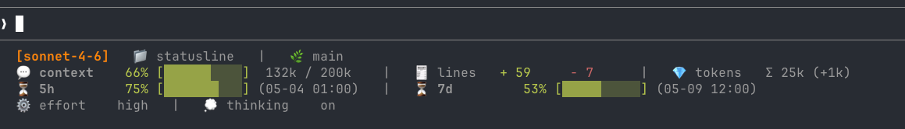

# Claude Statusline

A Claude Code statusline for model, workspace, context, rate limits, token
usage, cost, git branch, and agent metadata.

Two variants ship in `variants/`. Pick one at install time.

## Preview




## Variants

|                | `compact`                                     | `full`                                                          |
| -------------- | --------------------------------------------- | --------------------------------------------------------------- |
| Lines          | 1 or 2, depending on width                    | 3–4, fixed                                                       |
| Shows          | model, dir, branch, context, 5h, 7d           | the same, plus lines changed, token totals, cost, effort, thinking, agent |
| Width-aware    | yes, via `COLUMNS`                            | no                                                               |
| Relative speed | baseline                                      | roughly 4× slower                                                |

`compact` is the default. It renders on one line while the terminal is wide
enough and wraps the usage segments to a second line when it is not, shrinking
bars and labels through six compaction levels before it starts truncating the
directory and branch names.

## Features

- Context remaining percentage with a colored progress bar
- Five-hour and seven-day rate-limit windows with reset times
- Git branch detection when the workspace is inside a Git repository
- Graceful fallbacks for missing fields, invalid JSON, and missing `jq`

## Requirements

- Claude Code with `statusLine` support. `compact` reads `COLUMNS`, which
  Claude Code sets from v2.1.153 onward; on older versions it falls back to
  `stty size` and then to a fixed 120 columns
- Bash and `jq`
- `date`, and `perl` — `compact` measures the real display width of each
  candidate layout in perl, counting emoji and CJK as two cells, so it is not
  optional
- `awk`, used only by `full` and by the `COLUMNS` fallback path in `compact`
- Optional: `git`, for branch display

## Install

```bash
curl -fsSL https://raw.githubusercontent.com/sohee-zoe/claude-statusline/main/install.sh | bash
```

The installer asks which variant you want, downloads it to
`~/.claude/statusline.sh`, marks it executable, and asks whether to update
`~/.claude/settings.json`. Existing files are backed up before being replaced.

Non-interactively:

```bash
curl -fsSL .../install.sh | bash -s -- --compact -y
```

| Flag                | Meaning                                  |
| ------------------- | ---------------------------------------- |
| `--compact`         | Adaptive one/two-line statusline (default) |
| `--full`            | Original multi-line statusline           |
| `--variant NAME`    | `compact` or `full`                      |
| `-y`, `--yes`       | Update `settings.json` without asking    |
| `-n`, `--no-settings` | Never touch `settings.json`            |
| `-h`, `--help`      | Show usage                               |

`CLAUDE_STATUSLINE_VARIANT` does the same as `--variant`, and
`CLAUDE_CONFIG_DIR` overrides `~/.claude`. Your choice is recorded in
`~/.claude/.statusline-variant`, so a later reinstall keeps it by default —
including when there is no TTY to prompt on.

Both variants install to the same path, so the settings block is identical
either way:

```json
{
  "statusLine": {
    "type": "command",
    "command": "/Users/you/.claude/statusline.sh"
  }
}
```

The installer merges this into any existing `statusLine` block rather than
replacing it, so keys you set by hand survive. If you skip the prompt, it
prints the block for manual setup.

Claude Code reloads settings automatically, but the statusline usually updates
after the next interaction.

## Tuning `compact`

Export these before launching Claude Code.

| Variable                   | Default    | Meaning                                          |
| -------------------------- | ---------- | ------------------------------------------------ |
| `STATUSLINE_LINES`         | `auto`     | `1` or `2` to force the line count                |
| `STATUSLINE_PADDING`       | `4`        | Columns held back for UI chrome — see below       |
| `STATUSLINE_DIR_STYLE`     | `basename` | `path` shows the full `~/...` path                 |
| `STATUSLINE_CJK_AMBIGUOUS` | `0`        | `1` if `▓░` render two cells wide in your terminal |
| `STATUSLINE_COLUMNS`       | —          | Force a width, for testing                        |

`COLUMNS` is the width of the whole terminal, not the width available to the
statusline, so `compact` holds back `STATUSLINE_PADDING` columns. The default
of 4 is an estimate and may need adjusting for your setup: raise it if the
line wraps before the script has stepped down a compaction level, lower it if
the right edge is further in than it needs to be.

Note that `statusLine.padding` in `settings.json` is a different thing — it
*adds* horizontal padding on top of the interface's own spacing, and defaults
to `0`. It moves in the same direction as `STATUSLINE_PADDING`, so if you set
`padding: 2` you want to raise `STATUSLINE_PADDING`, not lower it.

## Notes

**Notifications share the statusline's row.** MCP server errors, auto-update
messages and the verbose-mode token counter appear to the *right* of the
statusline and will clip its output on a narrow terminal. On a one-line
layout the first thing to go is the `7d` segment. If that happens often,
raise `STATUSLINE_PADDING` or force two lines with `STATUSLINE_LINES=2`.

**`(mm-dd hh:mm)` placeholders are expected at the start of a session.**
`rate_limits` is only present for Claude.ai subscribers, and only after the
session's first API response. Each window can be absent independently.

**Nothing renders at all?** Claude Code will not run the `statusLine` command
in a directory whose workspace-trust dialog you have not accepted. Otherwise
`claude --debug` logs the exit code and stderr of the session's first run.

## Manual Installation

```bash
mkdir -p ~/.claude
cp variants/compact.sh ~/.claude/statusline.sh   # or variants/full.sh
chmod +x ~/.claude/statusline.sh
```

Then add the `statusLine` block shown above to `~/.claude/settings.json`.

## Development

Run checks:

```bash
bash -n variants/compact.sh
bash -n variants/full.sh
bash -n install.sh
shellcheck variants/*.sh install.sh
xmllint --noout assets/statusline-preview.svg
```

Run a local smoke test:

```bash
printf '%s\n' '{"model":{"id":"claude-sonnet-4-5"},"workspace":{"current_dir":"/tmp/example"},"context_window":{"remaining_percentage":72}}' | ./variants/compact.sh
```

Render at a range of widths:

```bash
sample='{"model":{"display_name":"Opus 4.5"},"workspace":{"current_dir":"/tmp/example"},
"context_window":{"context_window_size":200000,"remaining_percentage":72,
"current_usage":{"input_tokens":56000}},
"rate_limits":{"five_hour":{"used_percentage":35,"resets_at":1786000000},
"seven_day":{"used_percentage":88,"resets_at":1786400000}}}'

for c in 220 160 140 120 100 80 60 45; do
  printf -- '--- %s ---\n' "$c"
  printf '%s' "$sample" | STATUSLINE_COLUMNS=$c ./variants/compact.sh | sed 's/\x1b\[[0-9;]*m//g'
done
```

Exercise the installer without the network:

```bash
HOME=/tmp/fakehome CLAUDE_STATUSLINE_REPO_URL=file://$PWD bash install.sh --compact -y
```

## Credits

Inspired by Claude Code statusline tooling and documentation, including
CCometixLine, claude-lens, community `statusline.sh` examples, and the official
Claude Code statusline docs.
